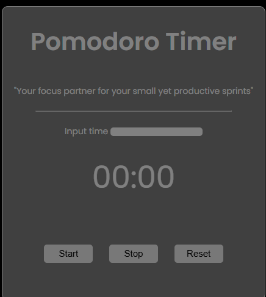

# Pomodoro Timer ⏱️🍅

A clean and customizable Pomodoro Timer that helps you stay focused during work or study sessions.  
Built using HTML, CSS, and JavaScript — with a modern design and flexible timer input.

---

## 🚀 Features

- ⏳ Custom input time — set your own Pomodoro session length
- 🔊 Beep sound alert when timer ends
- 🖱️ Start, Stop, and Reset buttons
- 📱 Responsive design (mobile-friendly)
- 🎨 Clean UI with modern Poppins font
- 🧠 Motivational subtitle for extra focus
- 🧼 No ads, no distractions

---

## 📸 Screenshot

---

## 🌐 Live Demo

👉 [Visit the hosted demo](pomodoro-by-yash.netlify.app)  
*(replace with your actual Netlify URL)*
💰 [Buy on Gumroad](https://codewithyash.gumroad.com/l/pomodoro-timer)

---

## 📦 Download & Use

1. Clone this repo or download as ZIP
2. Open `index.html` in your browser
3. Set your desired time and click **Start**

---

## 🛠️ Tech Stack

- HTML5
- CSS3
- JavaScript (Vanilla)

---

## 📁 Folder Structure

pomodoro-timer/
├── index.html
├── style.css
├── index.js
├── favicon.ico
├── beepsound.wav
├── image.png   

---

## 💡 Future Enhancements (optional ideas)

- Dark mode toggle
- Pomodoro cycle tracker (25/5/25/5/15)
- Save user preferences
- Visual animations for timer countdown

---

## 📜 License

This project is open source and free to use.  
Feel free to modify and share — just give credit if you use it publicly. 🙌

---

### 🔗 Built with ❤️ by Yash

